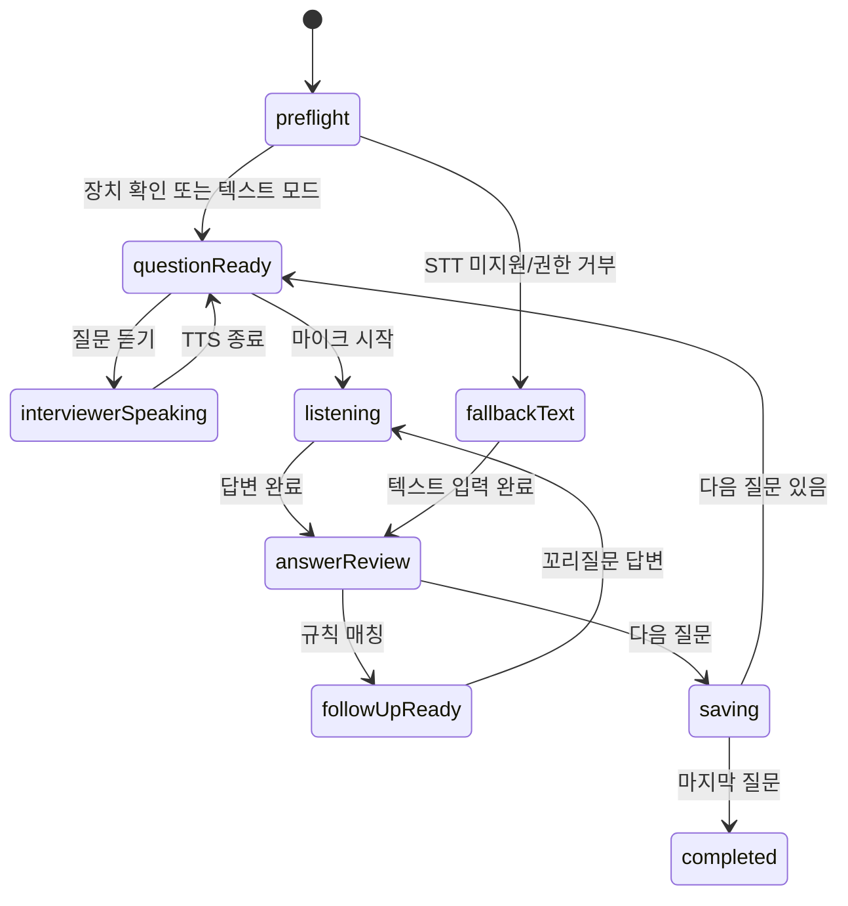

# Voice Interview JP — Zoom형 프런트엔드 구현 가이드

**대상:** 일본어 음성 모의 면접 트레이너의 면접 진행 화면  
**작성:** Manus AI  
**기준 문서:** `readme_3.md` (2026-09-01 검토)

## 결론

이 서비스에서 말하는 **Zoom형 프런트엔드**는 Zoom을 복제하거나 화상회의를 구현한다는 뜻이 아니라, 사용자가 이미 익숙한 **“면접실” 메타포**를 빌리는 것이다. 화면 중앙에는 면접관과 현재 질문을 크게 두고, 사용자는 오른쪽 위의 작은 자기 화면(Picture-in-Picture)에서 표정·자세를 확인하며, 하단의 고정 컨트롤 바에서 마이크·카메라·자막·패널을 조작한다. 이 구조는 음성 면접 연습의 몰입감을 높이면서도 핵심인 STT, 답변 편집, 규칙 기반 피드백을 방해하지 않는다.

> **권장 범위:** Zoom처럼 보이는 **1인 면접 룸 UI**까지만 구현한다. 다자간 통화, WebRTC 방 생성, 화면 공유, 채팅 동기화, 실제 녹화 업로드는 현재 서비스 요구사항과 0원 운영 원칙에 필요하지 않다.

따라서 면접·포트폴리오에서 Zoom 자체를 길게 설명할 필요는 없다. 아래 한 문단 정도면 충분하다.

> “사용자가 익숙한 화상 면접 환경을 재현하기 위해, 중앙 면접관 스테이지·자기 화면·고정 미디어 컨트롤·보조 패널이라는 Zoom형 인터랙션 패턴을 적용했습니다. 다만 다자간 화상회의 기능은 구현하지 않았고, 개인 연습에 필요한 음성 입력과 피드백 흐름에만 집중했습니다.”

Zoom의 상표, 로고, 고유 아이콘, 정확한 색상 체계나 화면을 그대로 복제하지 않는다. **회의 도구의 공간 구성과 조작 원리만 참조**하고, 서비스 고유의 일본어 학습 톤과 정보 구조로 재해석한다.

## 1. 제품에 맞는 화면 원칙

이 제품의 면접실은 일반적인 화상회의보다 **질문 이해 → 답변 발화 → 전사 확인 → 피드백**의 순서가 중요하다. 그러므로 여러 참가자의 카메라 타일을 나열하는 갤러리 뷰는 적합하지 않다. 대신 질문과 면접관 상태를 화면의 가장 큰 영역에, 사용자의 카메라 미리보기는 작은 보조 영역에 배치한다. 카메라는 평가 기능이 아니라 사용자가 원하는 경우에만 활용하는 셀프 체크 도구여야 한다.

| Zoom형 패턴 | Voice Interview JP에서의 해석 | 구현 우선순위 |
|---|---|---:|
| 중앙 스피커 스테이지 | 면접관 아바타, 현재 질문, TTS 재생 상태, 질문 자막 | 높음 |
| 우상단 자기 화면 | 사용자의 선택적 카메라 미리보기 또는 이니셜/파형 카드 | 중간 |
| 하단 고정 컨트롤 바 | 마이크, 카메라, 자막, 노트/대화 패널, 면접 종료 | 높음 |
| 우측 보조 패널 | 대화 전사, STAR/PREP 체크리스트, 개인 메모 | 높음 |
| 회의 상태 표시 | `질문 재생 중`, `답변 듣는 중`, `검토 중`, 타이머 | 높음 |
| 참가자 목록·화면 공유·초대 | 현재 범위에서 제외 | 제외 |

이 화면은 **집중 모드**가 기본이어야 한다. 일반 대시보드의 상단 내비게이션, 사이드바, 복잡한 통계 카드는 면접 시작 후 숨긴다. 사용자는 언제든지 현재 질문, 남은 시간, 마이크 상태, 다음에 눌러야 할 버튼을 2초 안에 파악할 수 있어야 한다.

## 2. 권장 레이아웃과 반응형 규칙

### 데스크톱: 3영역 + 고정 컨트롤

데스크톱에서는 전체 화면 높이를 사용한다. 상단 상태 바는 48px, 하단 컨트롤 바는 76px로 고정하고, 그 사이의 공간을 스테이지와 보조 패널이 채운다. 보조 패널은 기본 352px이며, 사용자가 닫으면 스테이지가 전체 폭을 차지한다.

```text
┌──────────────────────────────────────────────────────────────────────────────┐
│ ← 나가기  실전 모드 · N3 · 경어 자율     질문 2 / 6 · 01:43         연결 상태 │  48px
├───────────────────────────────────────────────┬──────────────────────────────┤
│                                               │  대화 전사 / 노트 / STAR     │
│              면접관 스테이지                  │  ───────────────────────     │
│        [아바타]  面接官  発話中…               │  面接官: 自己紹介を…          │
│                                               │  あなた: 私は…                │
│   「このプロジェクトで、最も困難だった…」       │  [실시간 전사 문장]           │
│                                               │                              │
│   자막 / 질문 다시 보기 / 답변 목표 60초       │  키워드, STAR 체크, 메모      │
│                              ┌─────────────┐  │                              │
│                              │ 내 화면/파형 │  │                              │
│                              └─────────────┘  │                              │
├───────────────────────────────────────────────┴──────────────────────────────┤
│   [마이크] [카메라] [자막] [패널] [다시 듣기]      [답변 완료 · 다음 질문] [종료] │  76px
└──────────────────────────────────────────────────────────────────────────────┘
```

### 태블릿과 모바일

태블릿에서는 우측 패널을 기본적으로 접고, `대화`, `STAR`, `메모` 버튼을 누르면 80% 폭의 드로어로 연다. 모바일에서는 면접관 스테이지를 화면 전면에 유지하고 자기 화면을 112×150px 정도의 세로 PIP로 축소한다. 하단 컨트롤은 아이콘만 보이는 1차 줄과 `답변 완료` 버튼을 강조한 2차 줄로 나누며, 전사와 메모는 전체 화면 바텀시트로 전환한다. 좁은 화면에서도 종료 버튼은 다른 위험한 버튼과 떨어뜨리고 `aria-label`을 유지한다.

| 화면 폭 | 기본 패널 | 자기 화면 | 권장 동작 |
|---:|---|---|---|
| 1280px 이상 | 우측 352px 상시 표시 | 240×135px | 질문·전사·체크리스트 동시 표시 |
| 768–1279px | 접힌 드로어 | 200×112px | 한 번에 하나의 보조 패널만 표시 |
| 767px 이하 | 바텀시트 | 112×150px | 질문 우선, 전사/메모는 필요할 때 열기 |

## 3. 시각 시스템과 상태 표현

어두운 배경은 화상 면접실의 집중감을 만들고 카메라 피로를 줄이지만, 학습 피드백은 높은 대비와 명확한 의미 색상을 사용해야 한다. 아래 색은 Zoom의 브랜드 재현이 아닌 서비스 고유의 예시 토큰이다.

| 토큰 | 예시 값 | 용도 |
|---|---|---|
| `--surface-room` | `#121826` | 면접실의 기본 배경 |
| `--surface-panel` | `#1C2536` | 패널과 카드 |
| `--text-primary` | `#F7F9FC` | 질문과 주요 정보 |
| `--accent-listening` | `#3BCB8E` | 마이크 활성·답변 듣기 |
| `--accent-speaking` | `#6EA8FE` | TTS 재생·면접관 발화 |
| `--accent-warning` | `#F4B740` | 권한·브라우저 안내 |
| `--danger` | `#E35D6A` | 종료·마이크 오류 |

상태는 색만으로 전달하지 않는다. 아바타 주변의 미세한 펄스, 상태 텍스트, 컨트롤의 `aria-pressed`를 함께 사용한다. 예를 들어 TTS 중에는 `면접관이 질문을 읽고 있습니다`, STT 중에는 `답변을 듣고 있습니다. 말한 내용은 화면에 표시됩니다`, 권한 거부 시에는 `마이크를 사용할 수 없습니다. 텍스트로 답변할 수 있습니다`라고 명시한다.

## 4. 기술 선택과 경계

현재 요구사항에는 **Next.js App Router + TypeScript + Tailwind CSS + Supabase** 조합을 권장한다. Vercel과의 배포 연결, 인증·세션 페이지 구성, Supabase 연동을 단순하게 만들기 때문이다. 이미 Vite 기반 프로젝트가 있다면 프레임워크를 바꾸지 말고, 아래의 `features/interview` 분리와 컴포넌트 구조만 동일하게 적용하면 된다.

브라우저 API는 클라이언트 컴포넌트에서만 호출한다. `SpeechRecognition`은 널리 공통 지원되는 기능이 아니며 일부 브라우저에서는 인식 처리를 위해 음성을 웹 서비스로 전송할 수 있으므로, 기능 감지와 텍스트 모드 폴백, 개인정보 고지가 필수다.[1] 마이크·카메라 접근은 HTTPS 환경에서 권한을 받아야 하며 사용자가 권한 창을 응답하지 않을 수도 있으므로, 로딩 상태와 취소 가능한 텍스트 모드 진입을 함께 둔다.[2]

| 관심사 | 권장 구현 | 저장 위치 |
|---|---|---|
| 질문·답변·세션 결과 | Supabase 테이블과 RLS | 서버 영속 데이터 |
| 현재 질문 번호·답변 초안·면접 단계 | `useReducer` 기반 면접 컨트롤러 | 페이지 메모리 |
| 패널 열림·자막 표시·카메라 PIP 위치 | Zustand 또는 로컬 UI 상태 | 브라우저 UI 상태 |
| `MediaStream`, `AudioContext`, recognition 인스턴스 | `useRef`로만 보관 | 직렬화하지 않음 |
| 실시간 중간 전사 | 로컬 상태 | `답변 완료` 전에는 DB 저장하지 않음 |
| 녹음 Blob | 기본 비저장, 명시적 동의 때만 IndexedDB 후 업로드 | 옵트인 |

`MediaStream`이나 `SpeechRecognition` 객체를 Zustand/Supabase에 넣지 않는 것이 중요하다. 이는 직렬화할 수 없고 페이지 생명주기와 결합되어 있기 때문이다. 답변이 확정되는 시점에만 정규화된 전사문, 발화 시간, 피드백 점수를 저장하면 불필요한 쓰기와 부분 데이터도 줄일 수 있다.

## 5. 권장 파일 구조

다음 구조는 ‘화면 컴포넌트’, ‘브라우저 음성 장치 제어’, ‘규칙 기반 면접 도메인 로직’을 분리한다. 이 분리를 지키면 나중에 STT 폴백 또는 질문 모드를 추가해도 `InterviewRoom`을 다시 쓰지 않아도 된다.

```text
src/
├── app/
│   └── (protected)/interview/[sessionId]/page.tsx
├── components/
│   └── ui/                         # Button, Sheet, Dialog, Tooltip 등 범용 UI
├── features/
│   └── interview/
│       ├── components/
│       │   ├── InterviewRoom.tsx    # 화면 조립만 담당
│       │   ├── RoomHeader.tsx
│       │   ├── InterviewStage.tsx   # 아바타·질문·자막
│       │   ├── SelfPreview.tsx      # 카메라 또는 파형/이니셜
│       │   ├── TranscriptPanel.tsx
│       │   ├── CoachingPanel.tsx    # STAR/PREP·규칙 피드백
│       │   ├── RoomControls.tsx
│       │   ├── PreflightDialog.tsx  # 장치·권한·개인정보 안내
│       │   └── TextAnswerFallback.tsx
│       ├── hooks/
│       │   ├── useInterviewMachine.ts
│       │   ├── useSpeechRecognition.ts
│       │   ├── useSpeechSynthesis.ts
│       │   ├── useMediaDevices.ts
│       │   ├── useAudioLevel.ts
│       │   └── useSessionTimer.ts
│       ├── lib/
│       │   ├── evaluateAnswer.ts
│       │   ├── followUpEngine.ts
│       │   ├── choonMatcher.ts
│       │   └── transcriptNormalizer.ts
│       ├── types.ts
│       └── constants.ts
└── lib/supabase/
    ├── client.ts
    └── queries.ts
```

`page.tsx`는 세션을 로드하고 권한을 검증한 뒤 `InterviewRoom`에 최소한의 데이터만 전달한다. 반대로 `InterviewRoom`이 Supabase 쿼리, 브라우저 권한 요청, 채점 규칙을 모두 직접 수행하게 만들면 테스트와 오류 복구가 매우 어려워진다.

## 6. 면접 상태 머신을 먼저 정의한다

버튼의 활성·비활성 조건을 개별 `useState`로 늘어놓지 말고, 면접의 진행 상태를 명시적으로 모델링한다. 특히 TTS 재생 중 STT가 켜지거나, 사용자가 종료한 뒤 `SpeechRecognition.onend`가 자동 재시작하는 문제를 예방할 수 있다.

```ts
export type InterviewPhase =
  | 'preflight'      // 장치 확인, 개인정보 안내, 모드 선택
  | 'questionReady'  // 질문 표시, 재생 전
  | 'interviewerSpeaking'
  | 'listening'      // 사용자의 답변 수집 중
  | 'answerReview'   // 전사 편집 및 다음 질문 확인
  | 'followUpReady'
  | 'saving'
  | 'completed'
  | 'fallbackText';

export type InterviewEvent =
  | { type: 'START_SESSION' }
  | { type: 'TTS_STARTED' }
  | { type: 'TTS_ENDED' }
  | { type: 'MIC_STARTED' }
  | { type: 'MIC_STOPPED' }
  | { type: 'ANSWER_CONFIRMED'; transcript: string }
  | { type: 'NEXT_QUESTION' }
  | { type: 'DEVICE_UNAVAILABLE' }
  | { type: 'END_SESSION' };
```

전이 규칙은 다음과 같이 제한한다. `interviewerSpeaking`에서는 마이크 시작을 비활성화하고 TTS가 끝난 뒤에만 `questionReady`로 전환한다. `listening`에서는 질문 넘기기 대신 `답변 완료`만 강조한다. `answerReview`에서 사용자는 STT 전사문을 직접 고친 후 확인한다. 이 편집 단계는 브라우저 인식 오류를 점수로 오해시키지 않기 위해 반드시 필요하다.



## 7. 음성 기능 구현 규칙

### 7-1. 사전 확인(Preflight)을 별도 화면으로 둔다

면접 룸 진입 즉시 브라우저 권한 창을 띄우지 않는다. 먼저 `카메라는 선택 사항이며 기본적으로 저장하지 않음`, `음성 인식은 브라우저 엔진을 사용할 수 있음`, `마이크를 허용하거나 텍스트 모드로 진행할 수 있음`을 설명하는 다이얼로그를 보여준다. 사용자가 `마이크 테스트 시작`을 눌렀을 때만 권한을 요청한다. 이 화면에서 입력 장치, 오디오 레벨, TTS 목소리, STT 지원 여부를 점검한다.

카메라는 마이크 승인과 분리한다. 기본값은 `off`이고, 카메라 버튼을 처음 누른 경우에만 `getUserMedia({ video: { facingMode: 'user' }, audio: false })`를 요청한다. 카메라를 끄거나 페이지를 떠날 때 모든 `MediaStreamTrack`에 `stop()`을 호출한다.

### 7-2. STT 훅은 중간 결과와 최종 결과를 분리한다

`useSpeechRecognition`은 UI 상태가 아니라 전사 이벤트만 제공하는 작은 어댑터로 만든다. 언어는 `ja-JP`, 중간 전사는 자막과 대화 패널에, 최종 전사는 사용자가 편집하는 답변 초안에 합친다. 인식 종료 후 자동 재시작은 사용자가 마이크를 켜 둔 상태이고 현재 단계가 `listening`일 때만 수행한다. 오류나 의도적인 종료 뒤에 재시작하면 안 된다.

```ts
// hooks/useSpeechRecognition.ts의 핵심 규칙 예시
const desiredListeningRef = useRef(false);
const phaseRef = useLatest(phase);

recognition.interimResults = true;
recognition.continuous = true;
recognition.lang = 'ja-JP';

recognition.onend = () => {
  const mayRestart = desiredListeningRef.current
    && phaseRef.current === 'listening';

  if (mayRestart) {
    window.setTimeout(() => recognition.start(), 150);
  }
};

function stopListening() {
  desiredListeningRef.current = false;
  recognition.stop(); // 현재 확보한 최종 결과를 받기 위해 abort()보다 우선
}
```

실제 구현에서는 `window.SpeechRecognition ?? window.webkitSpeechRecognition`를 기능 감지하고, 생성자 자체가 없거나 `not-allowed`, `audio-capture`, `network` 오류가 발생하면 오류 코드별 안내와 `텍스트로 답변하기` 버튼을 표시한다. 이 API의 브라우저 지원 폭이 제한적이라는 점이 바로 텍스트 폴백을 MVP에 포함해야 하는 이유다.[1]

### 7-3. 파형은 점수나 감시 장치가 아니라 발화 피드백이다

파형은 `getUserMedia({ audio: true })`로 얻은 스트림을 `AudioContext`의 `AnalyserNode`에 연결하여 만든다. `AnalyserNode`는 오디오를 바꾸지 않고 시간·주파수 데이터로 시각화를 만들 수 있어, 단순한 캔버스 파형에 적합하다.[3] 화면에는 ‘입력이 감지되고 있음’을 알려 주는 낮은 높이의 막대 또는 선만 표시하고, 음량 자체를 발음 점수로 계산하지 않는다.

`AudioContext`, animation frame, audio track은 컴포넌트 unmount와 마이크 off에서 반드시 정리한다. 이 정리가 없으면 면접을 나간 뒤에도 브라우저의 마이크 사용 표시가 남거나 다음 세션에서 장치가 잠긴 것처럼 보일 수 있다.

### 7-4. TTS는 질문 전용이며 수동 재생을 항상 제공한다

질문이 나타난 직후 자동 낭독을 할 수 있지만, 브라우저의 자동재생 정책과 사용자의 청취 속도 차이를 고려해 `다시 듣기` 버튼과 질문 텍스트를 항상 함께 제공한다. `speechSynthesis.cancel()`을 통해 다음 단계로 갈 때 이전 질문을 중단하고, 음성 목록 로드 지연 또는 일본어 음성 부재 시에는 텍스트 전용으로 자연스럽게 폴백한다. TTS가 재생되는 동안 STT는 시작하지 않아 면접관의 소리가 답변으로 전사되는 일을 막는다.

## 8. 첫 번째 세로 슬라이스 구현 순서

처음부터 모든 모드와 분석 기능을 넣지 않는다. 다음 순서로 **한 질문을 처음부터 끝까지 완료하는 경험**을 먼저 만든다. 이 순서는 UI를 만들고 나중에 음성 로직을 덧붙이다 상태가 꼬이는 위험을 낮춘다.

| 순서 | 완료 기준 | 이번 단계에서 하지 않을 것 |
|---:|---|---|
| 1 | 정적 더미 데이터로 데스크톱/모바일 면접실과 모든 상태 화면을 구현 | Supabase, 실제 STT |
| 2 | `preflight → 질문 → 텍스트 답변 → 편집 → 다음 질문`이 동작 | 카메라, 파형 |
| 3 | 실제 마이크 테스트, 파형, 마이크 on/off와 정리 동작 확인 | 녹음 파일 저장 |
| 4 | STT 중간/최종 전사와 텍스트 모드 폴백 구현 | 꼬리질문 자동화 |
| 5 | TTS 질문 낭독·다시 듣기와 상태 머신 결합 | 장음 점수 |
| 6 | 답변 확정 시에만 Supabase 저장, RLS 오류·절전 안내 처리 | 실시간 자동 저장 |
| 7 | 규칙 엔진의 꼬리질문, 경어 모드별 카피, 장음 미니 연습 연결 | Phase 3 통계 |

1단계에서는 `data-testid`를 부여해 둔다. 예를 들어 `room-stage`, `mic-toggle`, `self-preview`, `transcript-panel`, `answer-confirm`을 사용하면 이후 Playwright E2E 테스트가 안정적이다. 실서비스 질문을 대량으로 붙이기 전에, 질문 2개와 각각의 정적 꼬리질문만으로 상태 전이를 검증한다.

## 9. 인터페이스 조립 코드의 기준

`InterviewRoom`은 화면의 배치와 사용자 이벤트를 연결하지만, 각 기능의 세부 구현을 알지 않도록 유지한다. 아래는 의존성 방향을 보여 주는 축약 예시다.

```tsx
'use client';

export function InterviewRoom({ session, questions }: InterviewRoomProps) {
  const controller = useInterviewMachine({ session, questions });
  const media = useMediaDevices();
  const speech = useSpeechRecognition({
    enabled: controller.phase === 'listening',
    lang: 'ja-JP',
    onFinal: controller.appendFinalTranscript,
    onInterim: controller.setInterimTranscript,
    onError: controller.handleSpeechError,
  });

  return (
    <main className="min-h-dvh bg-room text-white">
      <RoomHeader session={session} state={controller} />
      <section className="grid min-h-0 grid-cols-1 lg:grid-cols-[minmax(0,1fr)_22rem]">
        <InterviewStage
          question={controller.currentQuestion}
          phase={controller.phase}
          interimTranscript={controller.interimTranscript}
          onReplay={controller.playQuestion}
        />
        <TranscriptPanel
          transcript={controller.draftTranscript}
          interimTranscript={controller.interimTranscript}
          onChange={controller.setDraftTranscript}
        />
      </section>
      <SelfPreview stream={media.cameraStream} audioLevel={media.audioLevel} />
      <RoomControls
        phase={controller.phase}
        micOn={speech.isListening}
        cameraOn={media.cameraOn}
        onToggleMic={speech.toggle}
        onToggleCamera={media.toggleCamera}
        onConfirmAnswer={controller.confirmAnswer}
        onEnd={controller.requestEnd}
      />
    </main>
  );
}
```

이 예시에서 `onConfirmAnswer`는 단순히 다음 질문 인덱스를 올리지 않는다. 먼저 전사문을 정규화하고, 사용자 보정 사전을 적용하며, 필러·정중체·시간·장음 신호를 규칙 함수로 계산하고, 필요하면 꼬리질문을 결정한 뒤 최종 결과만 저장한다. 이 순서를 `useInterviewMachine` 내부의 명시적 액션으로 유지해야 UI와 평가 결과가 불일치하지 않는다.

## 10. UX 카피와 개인정보 처리의 세부 기준

면접실의 언어는 사용자를 평가하거나 낙인찍지 않도록 설계한다. 특히 장음과 STT는 ‘발음 오류’보다 ‘인식 안정성’으로 표현하고, 경어 자율/보통체 허용 모드에서는 경고 대신 다음 연습 제안을 사용한다.

| 상황 | 피해야 할 문구 | 권장 문구 |
|---|---|---|
| 장음 패턴 불일치 | “장음 발음이 틀렸습니다.” | “이 단어는 STT가 장음을 짧게 인식할 수 있어요. 한 박자 더 늘려 다시 말해볼까요?” |
| 경어 비율 낮음 | “면접에 부적합합니다.” | “이번 답변의 정중체 비율은 약 40%입니다. 다음 답변에서 `です・ます`체를 한 번 더 사용해 보세요.” |
| 마이크 권한 거부 | “기능을 사용할 수 없습니다.” | “마이크 권한이 없어도 텍스트 모드로 전체 연습을 진행할 수 있습니다.” |
| STT 미지원 | “지원하지 않는 브라우저입니다.” | “이 브라우저에서는 음성 인식을 사용할 수 없습니다. 텍스트 모드 또는 Chrome/Edge에서 연습해 보세요.” |

프리플라이트와 설정 화면에는 다음을 분리해 고지한다. “카메라 미리보기는 기본적으로 업로드되지 않음”, “녹음 저장은 사용자의 별도 동의가 있을 때만 가능”, “브라우저 음성 인식 엔진은 브라우저에 따라 외부 처리될 수 있음”이다. 화면의 녹화 모양 아이콘을 실제 저장 기능 없이 표시하면 오해를 만들 수 있으므로, MVP에서는 숨기거나 `녹음 저장(선택)`으로 명확히 표기한다.

## 11. 검증 기준

자동 테스트는 브라우저 음성 인식 자체의 정확도를 검증하려 하지 말고, 권한·오류·상태 전이·저장 경계를 검증한다. 브라우저 API는 단위 테스트에서 mock하고, 실제 기기에서는 수동 검증표를 사용한다.

| 구분 | 검증 항목 | 통과 기준 |
|---|---|---|
| 단위 테스트 | `evaluateAnswer`, `followUpEngine`, `choonMatcher` | 동일 입력에 결정적 결과, 경계 조건 포함 |
| 컴포넌트 테스트 | 상태별 버튼 활성화, 자막, 텍스트 폴백 | `interviewerSpeaking`에서 마이크 시작 불가 |
| E2E 테스트 | 면접 시작부터 답변 확정·세션 종료까지 | 더미 장치와 더미 STT로 전체 흐름 성공 |
| 수동 테스트 | Chrome/Edge, Safari/Firefox, 모바일 브라우저 | 미지원 환경에서 텍스트 모드로 막힘없이 진입 |
| 권한 테스트 | 허용, 거부, 장치 없음, 권한 창 미응답 | 오류 원인과 대안이 화면에 명확히 표시 |
| 정리 테스트 | 카메라 off/페이지 이탈/세션 종료 | 미디어 트랙과 TTS가 중지되고 재진입 가능 |
| 접근성 테스트 | 키보드, 포커스, 대비, 스크린리더 | 모든 컨트롤에 이름·상태·포커스 순서 존재 |

## 12. 실제 개발 착수 체크리스트

1. 먼저 `interview/[sessionId]`에 더미 데이터 기반의 룸 화면을 만들고, 데스크톱·모바일 두 화면 폭에서 레이아웃을 확정한다.
2. `InterviewPhase`와 전이 표를 코드로 고정하고, 텍스트 답변만으로 한 질문의 완료 흐름을 통과시킨다.
3. `useMediaDevices`, `useAudioLevel`, `useSpeechRecognition`, `useSpeechSynthesis`를 화면과 독립된 훅으로 추가한다.
4. 사전 확인 다이얼로그, 권한 거부 처리, 텍스트 폴백을 실제 음성 기능보다 먼저 완성한다.
5. 답변 확정 경계에서만 Supabase에 저장하고, UI 초안·중간 전사·미디어 객체는 클라이언트에 남긴다.
6. 마지막으로 꼬리질문 규칙, 경어 모드별 피드백, 장음 연습 카드, 세션 복습 화면을 연결한다.

이 순서를 따르면 “Zoom처럼 보이는 화면”을 빠르게 보여 주면서도, 실제 서비스 품질을 좌우하는 음성 권한, STT 폴백, 상태 전이, 개인정보 고지를 처음부터 안정적으로 처리할 수 있다.

## References

[1]: https://developer.mozilla.org/en-US/docs/Web/API/SpeechRecognition "SpeechRecognition - Web APIs | MDN"
[2]: https://developer.mozilla.org/en-US/docs/Web/API/MediaDevices/getUserMedia "MediaDevices: getUserMedia() method - Web APIs | MDN"
[3]: https://developer.mozilla.org/en-US/docs/Web/API/AnalyserNode "AnalyserNode - Web APIs | MDN"
